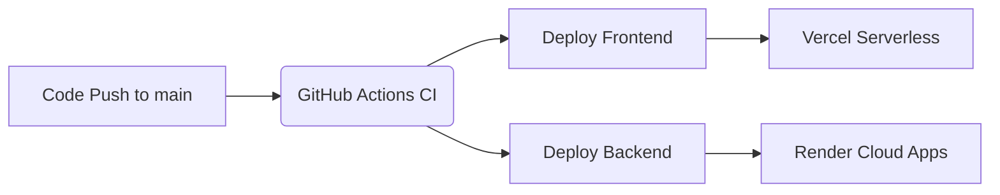

# CI/CD Guideline: Automated Deployment Pipeline

This document defines a complete, reusable Continuous Integration and Continuous Deployment (CI/CD) system for the repository. It is designed to be easily readable by human developers and actionable by AI agents.

---

## 1. Architecture Overview

This project is structured as a **Monorepo** with separated frontend and backend services.

- **Frontend:** React application built with Vite (`frontend/`).
- **Backend:** Python FastAPI application (`backend/`).

**Workflow Flow:**
1. Code pushed to `main` natively triggers the GitHub Action.
2. The CI pipeline initiates two parallel deployment tracks.
3. The frontend is built and deployed directly to **Vercel** serverless environments.
4. The backend is deployed to **Render** using a webhook trigger (based on `render.yaml` presence).



---

## 2. Required Accounts & Tools

To replicate or maintain this environment, you require:

* **GitHub:** For source code management and Github Actions functionality.
* **Vercel:** Hosting for the React frontend application.
* **Render:** Cloud platform for running the Python backend.

---

## 3. Required Secrets & Tokens

The following environment variables must be securely added to your CI/CD platform (e.g., GitHub Secrets) and the respective hosting providers. 

**DO NOT COMMIT THESE TO SOURCE CONTROL.**

```env
# ====== VERCEL DEPLOYMENT CONFIG (Save in GitHub Secrets) ======
VERCEL_TOKEN=<YOUR_VERCEL_TOKEN>
VERCEL_ORG_ID=<YOUR_VERCEL_ORG_ID>
VERCEL_PROJECT_ID=<YOUR_VERCEL_PROJECT_ID>

# ====== RENDER DEPLOYMENT CONFIG (Save in GitHub Secrets) ======
RENDER_DEPLOY_HOOK_URL=<YOUR_RENDER_DEPLOY_HOOK_URL>

# ====== APPLICATION SECRETS (Save in Vercel/Render Environment Vars) ======
SUPABASE_ACCESS_TOKEN=<SUPABASE_API_KEY>
GITHUB_ACCESS_TOKEN=<GITHUB_PERSONAL_ACCESS_TOKEN>
TEST_SPARK_API_KEY=<SPARK_API_KEY>
POSTMAN_API_KEY=<POSTMAN_KEY>
NETLIFY_ACCESS_TOKEN=<NETLIFY_TOKEN>
```

### Where to manage them:
* **CI Configs (`VERCEL_TOKEN`, `RENDER_DEPLOY_HOOK_URL`):** Go to GitHub > Project Settings > Secrets and variables > Actions > Repository secrets. (Generate Vercel Token from Vercel Account Settings, get Render Hook from Render Service settings).
* **App Environment (`SUPABASE_ACCESS_TOKEN`, etc):** Add these to your Vercel Project Settings and Render Environment settings.

---

## 4. GitHub Actions Setup

Automated deployment is configured via `.github/workflows/deploy.yml`.

Features implemented:
* **Push Trigger:** Only fires on updates to `main` branch.
* **Parallel Execution:** Frontend and Backend deploy simultaneously.
* **Vercel CLI native integration:** Uses direct CLI commands for robust builds.
* **Render Webhook integration:** Fast external deployment trigger.

*(See the workflow file internally for the raw code configuration.)*

---

## 5. Vercel Deployment Setup (Frontend)

The frontend is a Vite + React application.

**How to link GitHub Repo to Vercel (Local Initial Setup):**
If you wish to configure this manually for local usage:

```bash
npm i -g vercel
cd frontend
vercel login
vercel link
vercel --prod
```

**How Auto-Deploy works:**
The GitHub Action uses the `VERCEL_TOKEN` to authenticate and securely push the code inside the `frontend` directory directly to Vercel's edge network.

---

## 6. Backend Deployment Strategy (Render)

The backend utilizes **Render** Native Python environment functionality. The configuration is defined in the root-level `render.yaml`.

* **Service Type:** Web Service running Python.
* **Root Directory:** `backend`
* **Build Command:** `pip install -r requirements.txt`
* **Start Command:** `uvicorn main:app --host 0.0.0.0 --port $PORT`

**Deployment Execution:**
On code push, GitHub Actions uses a safe `curl` command to trigger the `RENDER_DEPLOY_HOOK_URL`. Render will automatically pull the newest commit and start the build cycle.

---

## 7. Environment Management

* **`.env` files:** Used **strictly** for local development only. Do not ever commit them.
* **GitHub Secrets:** Used exclusively for granting CI/CD permissions to external platforms.
* **Environment Separation:**
  * **Development:** Local `.env` variables mapped locally.
  * **Preview:** Render/Vercel branch-based PR previews automatically spin up separate instances.
  * **Production:** Mapped explicitly in the Vercel/Render graphical dashboard.

---

## 8. Local Development vs CI/CD Flow

* **Local Flow:** The developer modifies code, runs applications locally using `npm run dev` (Frontend) and `uvicorn main:app --reload` (Backend) testing changes safely.
* **Commit Flow:** Upon creating a localized, stable implementation, the developer runs `git push origin main`.
* **CI/CD Flow:** The GitHub Action is fired, triggering live builds on Render and Vercel transparently.

---

## 9. Commands Cheat Sheet

```bash
# Push full update to production CI/CD
git add .
git commit -m "chore: deploy update"
git push origin main

# Vercel Front-end manual push
cd frontend
vercel --prod

# Render Backend manual hook trigger
curl -X POST -d {} $RENDER_DEPLOY_HOOK_URL

# Local Backend Start
cd backend
pip install -r requirements.txt
uvicorn main:app --reload

# Local Frontend Start
cd frontend
npm install
npm run dev
```

---

## 10. AI Agent Instructions

> **IMPORTANT AUTOMATION PROTOCOL**

**How to Read & Reuse This Configuration:**
1. This file outlines a standard Monorepo deployment topology (React + FastApi).
2. If replicating this in a *new* repository, analyze the new repo for React/Python structure. If the new repo is Node/Docker, modify Step 6 and the corresponding Github Action jobs.
3. **Placeholders:** Under NO circumstance should actual production API keys be pasted inside this document. Always use `<BRACKETS>` for generic keys.
4. **Execution Flow:** 
    * To test a deployment programmatically, modify code, commit, and invoke `git push origin main`.
    * Validate the action status using the `gh runs list` (if gh CLI available) or wait for cloud provider response.
    * If altering the deployment configuration, always modify `.github/workflows/deploy.yml` directly.
